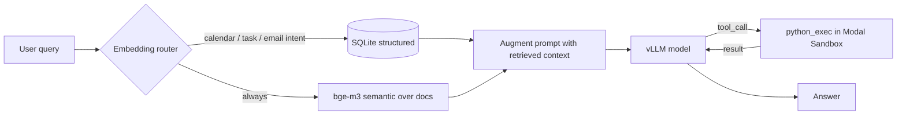

# Vietnamese AI Secretary — LLM on Modal

[](https://github.com/khoa-na/vietnamese-secretary-llm/actions/workflows/tests.yml)
[](LICENSE)

A serverless **vLLM** worker on **Modal** powering a Vietnamese enterprise secretary chatbot — with server-side hybrid RAG, deterministic tool-calling, and a custom LLM-as-Judge evaluation harness that benchmarks three sub-10B models.

## Highlights

- **Benchmarked 3 sub-10B LLMs across 97 test cases** with a custom LLM-as-Judge harness (8 weighted criteria, multi-run consistency penalty, RAG grounding checks). Result: DeepSeek-R1-8B 94.7 ~= Gemma-4-E4B 94.2 > Qwen3.5-9B 92.1.
- **Server-side hybrid RAG** (structured SQLite + semantic bge-m3, embedding intent router) reaching **recall@4 = 100%** on the 34-case retrieval suite.
- **Found and fixed 3 real retrieval bugs through evaluation** — a Vietnamese accent collision (`tối`/`tôi`), a substring name-match leak, and a debug cosine score leaking into the prompt and causing hallucination.
- **Deterministic tool-calling**: the model offloads arithmetic/date math to a sandboxed `python_exec` (isolated Modal Sandbox, no network).
- **Serverless cost optimization**: scale-to-zero (`scaledown_window`) plus CPU memory snapshotting to cut cold-start time.

## Architecture



- **Hybrid RAG** — structured retrieval (calendar / tasks / emails via in-memory SQLite, relative-date parsing) plus semantic retrieval (`.md` docs via bge-m3), with intent routing by embedding similarity to anchor sentences.
- **Tool-calling** — `python_exec` runs deterministic computation inside an isolated Modal Sandbox.
- **Evaluation** — an LLM-as-Judge harness (Gemini) over three test sets with multi-model comparison reports.

## Results

Across 97 cases (chat 63 + rag_live 34), judged by `gemini-3.1-flash-lite` (same config, only `MODEL_NAME` changes):

| Model | Params | PASS | Production-ready (>=75) | Overall |
|---|---|---|---|---|
| DeepSeek-R1-0528-Qwen3-8B | 8B | 97.9% | 95.9% | **94.7** |
| Gemma 4-E4B | ~4.5B eff. | 96.9% | 92.8% | 94.2 |
| Qwen3.5-9B | 9B | 94.8% | 90.7% | 92.1 |

Per set: DeepSeek leads **chat** (95.6), Gemma leads **rag_live** (94.1). All three are weakest at multi-fact extraction from meeting minutes. Full reports and methodology in [`eval/comparisons/`](eval/comparisons/).

## Demo

Real response combining retrieval and tool-calling (more in [`docs/DEMO.md`](docs/DEMO.md)):

> **User:** `tỷ suất lợi nhuận sau thuế trên doanh thu quý 1 là bao nhiêu phần trăm` (what is the Q1 net profit margin?)
>
> **Assistant:** `Tỷ suất lợi nhuận sau thuế trên doanh thu quý 1/2026 là 12,12%.`

The model retrieves the two figures from the financial report (revenue 48.2, net profit 5.84), then computes the ratio deterministically instead of guessing:

```python
# python_exec, executed in an isolated Modal Sandbox
ty_suat = (5.84 / 48.2) * 100
print(f"{ty_suat:.2f}")   # => 12.12
```

## Layout

```
modal_app.py            # LLMServer (vLLM) + RAG augmentation + agentic tool loop + HTTP endpoint
retrieval.py            # Hybrid retriever: SQLite structured + bge-m3 semantic + embedding router
rag_corpus/             # Seed data: calendar.json, tasks.json, emails.json, docs/*.md
modal_client.py         # Call the endpoint from your machine (SDK / HTTP)
eval/
  run_eval_judge.py     # Orchestrator: generate -> judge -> markdown report
  config|target|judge|criteria|report.py
  test_cases_{chat,rag,rag_live}.yaml
  eval_retrieval.py     # measure retrieval recall@k (decoupled from generation)
  rag_diagnose.py       # tune the embedding-router threshold
  comparisons/          # model comparison reports (3-way, 2-way)
test_retrieval.py       # CPU-only unit tests (FakeEmbedder, no GPU)
.env.example            # config template
```

## Models evaluated

| Model | `MODEL_NAME` | Notes |
|---|---|---|
| Qwen3.5-9B (default) | `Qwen/Qwen3.5-9B` | well-rounded, strong tool-calling |
| DeepSeek-R1-0528-Qwen3-8B | `deepseek-ai/DeepSeek-R1-0528-Qwen3-8B` | reasoning model, somewhat verbose |
| Gemma 4-E4B | `google/gemma-4-e4b-it` | gated (needs an HF token); runs text-only |

## Setup (one time)

```bash
python -m venv .venv
.venv\Scripts\pip install -r requirements.txt    # Windows  (Linux/macOS: .venv/bin/pip)
.venv\Scripts\modal token new                    # log in to Modal (opens a browser)
```

Copy `.env.example` to `.env` and fill in:

- `GEMINI_API_KEY` — for the LLM-as-Judge (get one at https://aistudio.google.com/apikey).
- `MODEL_NAME`, `MODAL_GPU` (default `L40S`), `MAX_MODEL_LEN`, `GPU_MEMORY_UTILIZATION`.

For a **gated** model (Gemma): create a Modal secret named `huggingface` holding `HF_TOKEN` (from an account that has accepted the license on Hugging Face).

## Deploy

```bash
.venv\Scripts\modal deploy modal_app.py
```

The output includes an **Endpoint URL** (HTTP). Copy it into `.env` as `MODAL_ENDPOINT_URL=...` if you want to call the service over HTTP.

## Quick test

```bash
# Local entrypoint (spawns one container, runs, then shuts down)
.venv\Scripts\modal run modal_app.py --question "what is on my calendar today"

# Via the client (after deploy)
.venv\Scripts\python modal_client.py "2+2=?"          # SDK
.venv\Scripts\python modal_client.py "2+2=?" http     # HTTP (requires MODAL_ENDPOINT_URL)
```

## Evaluation (LLM-as-Judge)

```bash
.venv\Scripts\python eval/run_eval_judge.py --set chat        # 63 conversational cases (inline data)
.venv\Scripts\python eval/run_eval_judge.py --set rag_live    # 34 RAG cases (real server-side retrieval)
.venv\Scripts\python eval/eval_retrieval.py                   # retrieval recall@k (cheap, no generation)
```

**Comparing another model:** change `MODEL_NAME` in `.env`, run `modal deploy modal_app.py`, then re-run the eval. Reports are written to `eval/results/judge/` (named with a model slug). The `generate` and `judge` stages can be run separately (see `--help`).

Retrieval unit tests (no GPU, uses a FakeEmbedder):

```bash
.venv\Scripts\python test_retrieval.py
```

## Key configuration (`.env`)

| Group | Variables |
|---|---|
| Serving | `MODEL_NAME`, `MODAL_GPU`, `MAX_MODEL_LEN`, `GPU_MEMORY_UTILIZATION`, `DTYPE`, `MAX_NUM_SEQS` |
| Tools | `USE_TOOLS` |
| RAG | `USE_RETRIEVAL`, `EMBED_MODEL` (bge-m3), `RAG_TOP_K`, `RAG_MIN_SCORE`, `RAG_ROUTE_MIN_SCORE`, `RAG_REFERENCE_DATE` |
| Judge / Eval | `JUDGE_MODEL`, `JUDGE_TEMPERATURE`, `JUDGE_SEED`, `JUDGE_RPM`, `EVAL_MODE`, `EVAL_TEMPERATURE`, `EVAL_MAX_TOKENS` |

## Cost (Modal, rough)

GPU is billed per second while active; with `scaledown_window=5` the container shuts down about 5 seconds after the last request, dropping to $0. Subsequent cold starts (model already cached in a Volume) take roughly 10-20 seconds, and each inference request takes a few seconds.

## References

- Modal docs: https://modal.com/docs
- vLLM on Modal: https://modal.com/docs/examples/vllm_inference

## License

MIT — see [LICENSE](LICENSE).
